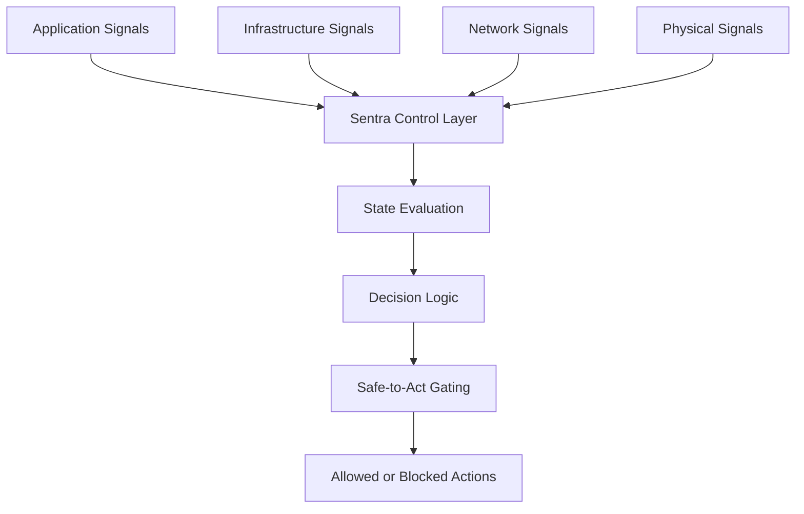
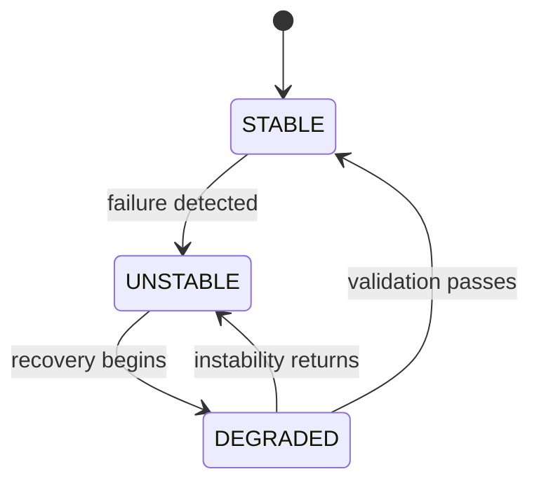
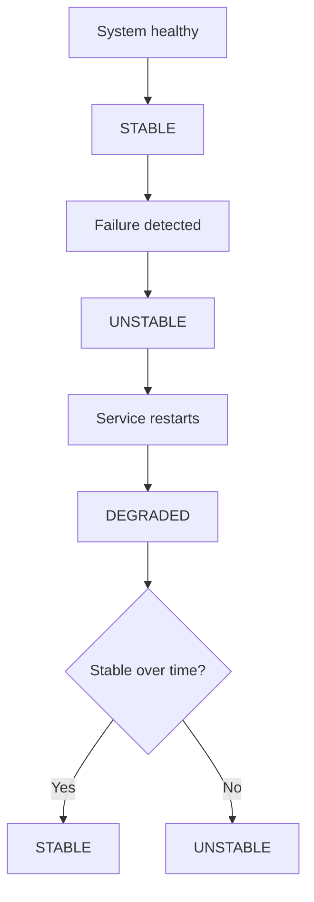
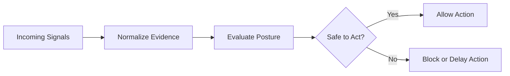

# Sentra
> A system that determines whether infrastructure is truly stable — not just operational.

Sentra is a control layer developed within Trellis Systems.

It determines system posture and governs when action is safe.

---

## The Problem

Modern systems are rich in signals but poor in judgment.

They can report whether something is up or down, healthy or unhealthy, reachable or unreachable. But they still leave teams to answer the question that matters most:

> **Is this system actually safe to act on right now?**

That gap creates real operational risk:

- systems appear recovered before stability is proven  
- actions are taken on partial or misleading signals  
- “green” dashboards hide degraded reality  
- instability spreads because systems are treated as ready too soon  

---

## The Shift

Sentra introduces a different model:

> **State over status.**

Instead of asking whether a component is merely available, Sentra determines whether the system is:

- actually stable  
- still in recovery  
- operating under unresolved uncertainty  
- safe to act on  

This transforms infrastructure from passive reporting to active operational judgment.

---

## Core Concepts

### State, not status
Sentra evaluates systems as:

- **STABLE**
- **DEGRADED**
- **UNSTABLE**

These states reflect operational truth, not superficial availability.

---

### Recovery is not resolution
A system returning to service does not mean it has regained trust.

Sentra treats recovery as a phase that must be validated over time before stability is restored.

---

### Safe-to-act gating
Actions are governed by posture, not optimism.

If the system is degraded or unstable, Sentra can block or delay downstream actions until conditions are truly safe.

---

### Multi-signal evaluation
Sentra evaluates posture across multiple signal domains:

- application  
- infrastructure  
- network  
- physical  

This allows decisions to reflect combined system reality rather than isolated checks.

---

## Conceptual Architecture

---

## State Model

A system can be back, but not yet trustworthy.

---

## Example Operational Flow

During **DEGRADED:**

- recovery is observed, not assumed,
- action remains constrained
- trust is rebuilt through sustained evidence

---

## Decision Model

Sentra answers a question most systems leave unresolved:

> **What should happen next, given the current level of confidence?**

---

## What This Enables
- Preventing actions during unstable recovery windows
- Detecting degraded reality behind healthy-looking systems
- Coordinating behavior across inconsistent signals
- Introducing time-based trust restoration
- Moving from reactive monitoring to controlled decision-making

---

## Use Cases

### Deployment Safety

A service appears healthy after restart.
- Traditional systems: allow deploy
- Sentra: identifies recovery phase → **blocks deployment until stability is proven**

---

### Hidden Network Degradation

Services report healthy, but network conditions degrade.
- Traditional systems: remain green
- Sentra: detects instability → **maintains DEGRADED posture**

---

### Flapping Systems

A service repeatedly fails and recovers.
- Traditional systems: oscillate between states
- Sentra: maintains degraded posture → **prevents premature trust**

---

### Node Loss and Recovery

A node disappears and later returns.
- Traditional systems: mark healthy when reachable
- Sentra: enforces validation window → **delays return to STABLE**

---

### Action Governance

A downstream action is requested.
- Sentra evaluates system posture
- If not STABLE → **action is blocked or delayed**

---

### Positioning

Sentra does not replace existing tools.
- Observability provides visibility
- Orchestration provides execution
- **Sentra provides judgment**

---

## Why It Matters

Systems fail not because they lack data,
but because they act on it incorrectly.

Sentra introduces:
- confidence-aware evaluation
- time-based validation of recovery
- decision control under uncertainty

This is a shift from reporting conditions to governing operational trust.

---

## Status

Active development.

Current focus:
- state modeling
- signal evaluation
- recovery validation
- action gating

---

## About Trellis Systems

Sentra is being developed within Trellis Systems,
a platform for intelligent system orchestration and decision-making.

---

## Note

This repository provides a high-level view of the system.

Implementation details and internal architecture are not publicly exposed.
