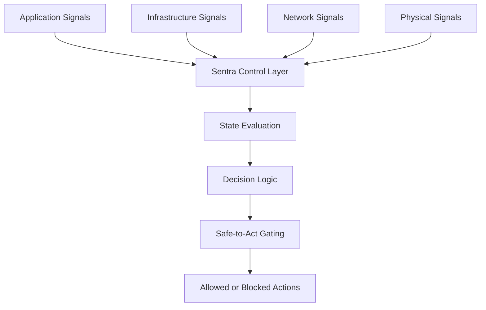
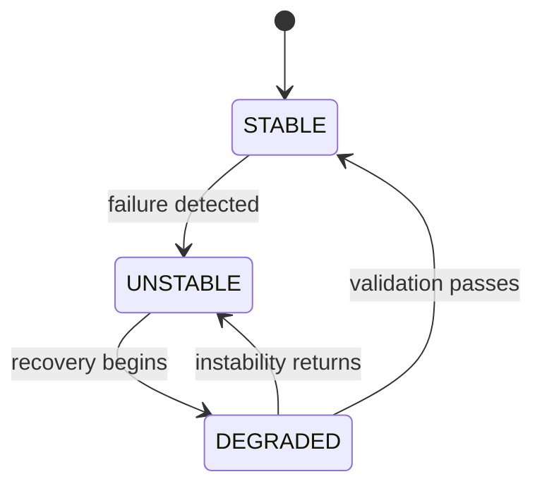
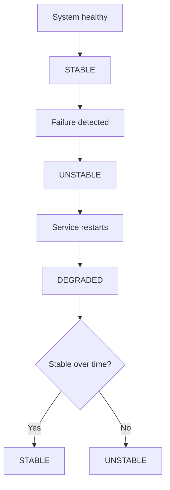
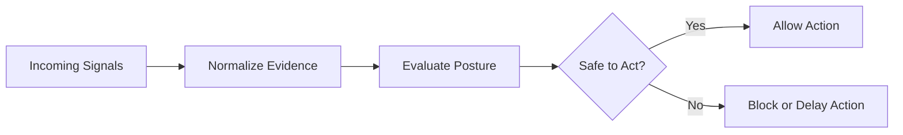

# Sentra

Sentra is a control layer developed within Trellis Systems.

It determines system posture and governs when action is safe.

---

## The Problem

Modern systems are rich in signals but poor in judgment.

They can report whether something is up or down, healthy or unhealthy, reachable or unreachable. But they still leave teams to answer the question that matters most:

> **Is this system actually safe to act on right now?**

That gap creates real operational risk:

- systems appear recovered before stability is proven  
- actions are taken on partial or misleading signals  
- “green” dashboards hide degraded reality  
- instability spreads because systems are treated as ready too soon  

---

## The Shift

Sentra introduces a different model:

> **State over status.**

Instead of asking whether a component is merely available, Sentra determines whether the system is:

- actually stable  
- still in recovery  
- operating under unresolved uncertainty  
- safe to act on  

This transforms infrastructure from passive reporting to active operational judgment.

---

## Core Concepts

### State, not status
Sentra evaluates systems as:

- **STABLE**
- **DEGRADED**
- **UNSTABLE**

These states reflect operational truth, not superficial availability.

---

### Recovery is not resolution
A system returning to service does not mean it has regained trust.

Sentra treats recovery as a phase that must be validated over time before stability is restored.

---

### Safe-to-act gating
Actions are governed by posture, not optimism.

If the system is degraded or unstable, Sentra can block or delay downstream actions until conditions are truly safe.

---

### Multi-signal evaluation
Sentra evaluates posture across multiple signal domains:

- application  
- infrastructure  
- network  
- physical  

This allows decisions to reflect combined system reality rather than isolated checks.

---

## Conceptual Architecture

---

## State Model

A system can be back, but not yet trustworthy.

---

## Example Operational Flow

During **DEGRADED:**

- recovery is observed, not assumed,
- action remains constrained
- trust is rebuilt through sustained evidence

---

## Decision Model

Sentra answers a question most systems leave unresolved:

> **What should happen next, given the current level of confidence?
